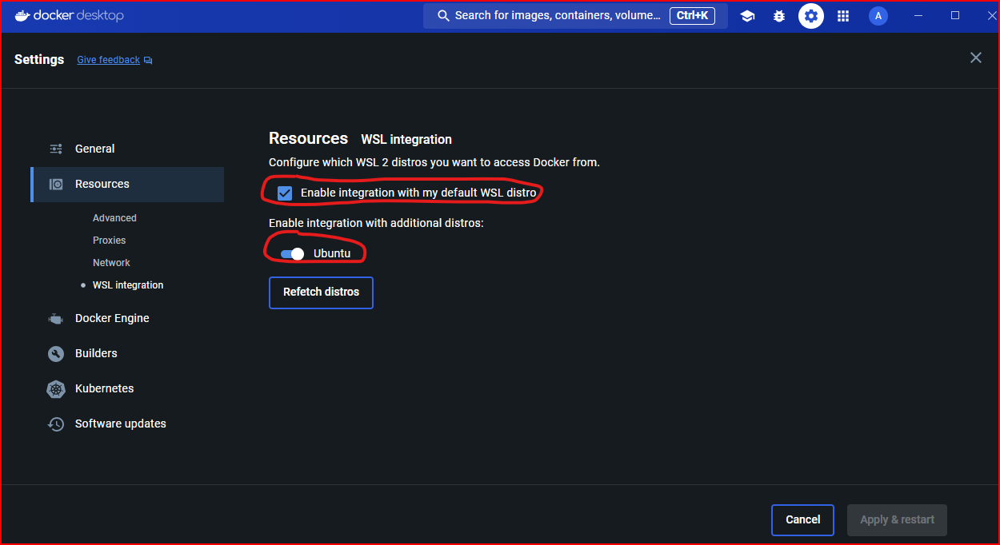

# 🌍 **VayuAssist: RAG-Based AI Chatbot & AQI Dashboard**

**VayuAssist** is an AI-powered assistant designed to help **government policymakers** make data-driven decisions regarding **air quality and pollution control** in India. The solution combines **RAG-based contextual search**, **OpenAI GPT-3.5 Turbo LLM**, and **interactive dashboards** to visualize AQI data and provide mitigation strategies.

---

## 🚀 **Features**

✅ **AI-Powered Chatbot**:  
- Leverages **RAG-based contextual search** to provide intelligent answers.  
- Utilizes **Pathway + OpenAI GPT-3.5 Turbo** for response generation.  
- Retrieves contextual data from Dropbox documents.  

✅ **Air Quality Dashboards**:  
- Interactive visualizations using **Plotly, Seaborn, and Folium**.  
- Displays **AQI trends, impacted locations, and mitigation strategies**.  
- Provides dynamic filtering by **location, time, and pollutant**.  

✅ **Real-time Contextual Ingestion**:  
- Streams PDF and CSV data from **Dropbox**.  
- Extracts and chunks content using **Pathway parsers**.  
- Generates embeddings for contextual retrieval.  

✅ **Mitigation Strategies & Insights**:  
- Displays **short-term and long-term mitigation** strategies.  
- Categorizes strategies by **pollution sources and impacted populations**.

---

## ⚙️ **Architecture**

### **High-Level Flow**

1. **User Interaction:**  
   - Users query through the **Streamlit UI** or view AQI dashboards.  
   - User inputs are sent to the **API** for processing.  

2. **Data Ingestion & Chunking:**  
   - Real-time streaming of PDF and CSV files from **Dropbox**.  
   - Chunking and embedding using **Pathway parsers**.  

3. **AI-Powered Query Execution:**  
   - Queries are embedded and compared with indexed data.  
   - Nearest neighbor search retrieves relevant content.  
   - LLM generates responses based on **retrieved context**.  

4. **Visualization & Insights:**  
   - Displays AQI trends and mitigation strategies using **Streamlit Dashboards**.  
   - Renders geographical maps with **Folium**.  
   
5. **EasyOCR Integration:**
    - Extracts text from images stored in Dropbox.
    - Enhances the RAG model with OCR-extracted context.

---

## 🛠️ **Tech Stack**

- **Frontend:**  
    - Streamlit (Python)  
    - Plotly, Seaborn, Folium for visualizations  

- **Backend:**  
    - Pathway (Real-time data processing)  
    - Python (Flask-based API)  
    - OpenAI GPT-3.5 Turbo (LLM)  

- **Data Sources:**  
    - PDF/CSV files from **Dropbox**  
    - Static sensor data for AQI analysis  

- **Embeddings & Vector Search:**  
    - OpenAI Embeddings API  
    - Real-time indexing with Pathway  

---

## 📊 **Dashboards**

### **1. Air Quality Dashboard**
- Interactive AQI visualizations.  
- Dynamic filters by **category, location, and timeframe**.  
- Bar and pie charts for category distribution.  
- Map with AQI levels using **Folium**.  

### **2. Mitigation Strategies**
- Long-term and short-term measures for pollution sources.  
- Categorized by **industrial, vehicular, and population-based impacts**.  

### **3. AI-Powered Chatbot**
- Real-time query response.  
- Context retrieval from Dropbox files.  
- Displays relevant images from PDF documents.  

## 🛠️ **Technical Architecture**

### **VayuAssist – RAG-based AI Chatbot and Dashboard**

### **High-Level Architecture**

                          ┌───────────────────────────────┐
                          │         Frontend (UI)         │
                          │      Streamlit (vayuassistUi) │
                          │ ──> Dashboard & AI Chatbot    │
                          │ ──> Map Visualization         │
                          │ ──> AQI Trend Analysis        │
                          │ ──> Mitigation Strategies     │
                          └────────────▲──────────────────┘
                                       │
                        User Query     │
                         (LLM Call)    │
                                       │
                          ┌────────────▼────────────┐
                          │   Backend (API Layer)   │
                          │         FastAPI         │
                          │ ──> Receives Queries    │
                          │ ──> Fetches from RAG    │
                          │ ──> Returns Response    │
                          └────────────▲────────────┘
                                       │
          ┌────────────────────────────┴─────────────────────────────┐
          │                        Pathway Engine                     │
          │ ──> RAG-based Contextual Retrieval                        │
          │ ──> PDF Parsing & Chunking                                │
          │ ──> Embedding Generation (OpenAI)                         │
          │ ──> Vector Index for Fast Retrieval                       │
          │ ──> Dropbox File Sync (New Context)                       │
          │ ──> EasyOCR Image Text Extraction                         │
          └──────────────────────────────────────────────────────────┘
                                       │
               ┌────────────────────────┴────────────────────────┐
               │                  Data Sources                   │
               │ ──> Static CSV for AQI and Sensor Data          │
               │ ──> Dropbox PDFs (RAG Context)                  │
               │ ──> Extracted Text from Images via EasyOCR     │
               └────────────────────────────────────────────────┘


### ✅ **Components Overview**

1. **Frontend (Streamlit App)**:  
   - `vayuassistUi.py`:  
     - UI interface built with **Streamlit**.
     - Displays dashboards using **Plotly, Seaborn, and Folium**.
     - Sends queries to the API for AI-powered responses.
     - Displays dynamic AQI data with visualizations.

2. **Backend (Pathway Engine)**:  
   - `pathwayEngine.py`:  
     - Initializes the **Pathway library** classes.  
     - Calls `api.py` to handle user queries.  
     - Includes scheduling logic for checking new documents in **Dropbox**.

3. **API Layer (RAG-based Contextual Search)**:  
   - `api.py`:  
     - Handles user queries and routes them through the **Pathway Engine**.  
     - Streams real-time data from Dropbox.  
     - Uses **Pathway parsers** and chunkers to preprocess unstructured data.  
     - Creates embeddings using **OpenAI GPT-3.5 Turbo**.  
     - Performs nearest neighbor search for context retrieval.

4. **Data Sources & Embeddings**:  
   - Ingests PDF and CSV files from Dropbox.  
   - Splits documents into chunks.  
   - Embeds and indexes the data in real-time.  
   - Renders dashboards from pre-processed CSV data.


---

## 📁 **File Structure**

```
/vayuassist
 ├── /data                     # CSV Data Files
 ├── /common                   # Helper Modules (Graphical Engine, Embedding, OCR)
 ├── vayuassistUi.py           # Streamlit UI Application
 ├── pathwayEngine.py          # Pathway Engine Starter
 ├── api.py                    # Backend RAG API
 ├── dropbox_script.py         # Dropbox Syncing Logic
 ├── README.md                 # Documentation
 ├── requirements.txt          # Python Dependencies
 └── .env                      # Environment Variables
```


## 🔧 **Installation & Setup**

### **Prerequisites**
- Python 3.9+  
- Docker (optional for containerization)  
- Dropbox account with access to documents 

1. For window users, you will need to download & install [Windows Subsystem for Linux](https://ubuntu.com/desktop/wsl) first. You can refer the [Tutorial Video](https://www.youtube.com/watch?v=eId6K8d0v6o) for more information regarding the installation.
2. **Windows Subsystem for Linux (WSL):**
WSL is a compatibility layer for running Linux binary executables natively on Windows. WSL 2, the latest version, uses a real Linux kernel and offers improved performance and full system call compatibility.

3. **Advantages of WSL:**
  - **Integration:** Allows running Linux applications and tools alongside Windows applications.
  - **Performance:** WSL 2 offers significant performance improvements over WSL 1 by using a real Linux kernel.
  - **Ease of Use:** Provides a seamless development environment for developers who work on both Windows and Linux.
    
4. For MAC/Linux/Debian users no specific requirements needed.
5. Since you are inside new Linux Environment, you might need to install many python libraries like pip,python3 etc.You will know once you run the aeroIntelRun.py file.
5. Also, we are using the OpenAI LLM model and encder model ,please be handy with the APIKey.

### Docker and WSL on Windows

1. **Docker:** Docker is a platform that enables developers to build, ship, and run applications in containers. Containers are lightweight, standalone, and executable packages that include 
               everything needed to run a piece of software, including the code, runtime, libraries, and system dependencies.

   - **Advantages of Docker:**
       - **Consistency:** Ensures that applications run the same way regardless of where they are deployed.
       - **Isolation:** Each container runs in its own isolated environment, preventing conflicts between dependencies.
       - **Portability:** Containers can run on any system that supports Docker, including different operating systems and cloud platforms.
       - **Efficiency:** Containers are more lightweight compared to virtual machines, sharing the host OS kernel and using fewer resources.

2. **Using Docker with WSL:** Combining Docker with WSL 2 provides a powerful and efficient development environment on Windows. Docker Desktop for Windows integrates with WSL 2 to provide a native-like Linux development experience.

3. **Install Docker Desktop:**
     - Download and install Docker Desktop for Windows from the Docker website.
     - During installation, enable the option to use the WSL 2-based engine.
     
4. **Integrate Docker with WSL:**


5. **Install DropBox:**
     - Since we are using drop box as our context repository,we require drop box and the access token to call drop box api in order to download the context building materials.
     - Go to [DropBox oauth-guide](https://developers.dropbox.com/oauth-guide)  site to get your Dropbox access token

### **Environment Variables**
Create a `.env` file with the following variables:

```env
HOST=api
PORT=8080
DROPBOX_LOCAL_FOLDER_PATH=/usr/local/documents
OPENAI_API_KEY=your_openai_api_key
```

### **Install Dependencies**
```bash
pip install -r requirements.txt
```


### **Start the Application**
```bash
# Start the backend API
python pathwayEngine.py

# Start the Streamlit UI
streamlit run vayuassistUi.py
```


## 🚀 **Usage**

1. **Run the backend API:**  
```bash
python pathwayEngine.py
```

2. **Start the Streamlit UI:**  
```bash
streamlit run vayuassistUi.py
```

3. **Interact with the Chatbot & Dashboards:**  
- Ask air quality-related questions.  
- View dynamic AQI trends.  
- Explore mitigation strategies.  

---

## 🛡️ **Future Enhancements**
- **Predictive AQI modeling** using historical data.  
- **Real-time data streaming** for live AQI insights.  
- **More LLM integrations** for multi-model responses.  


